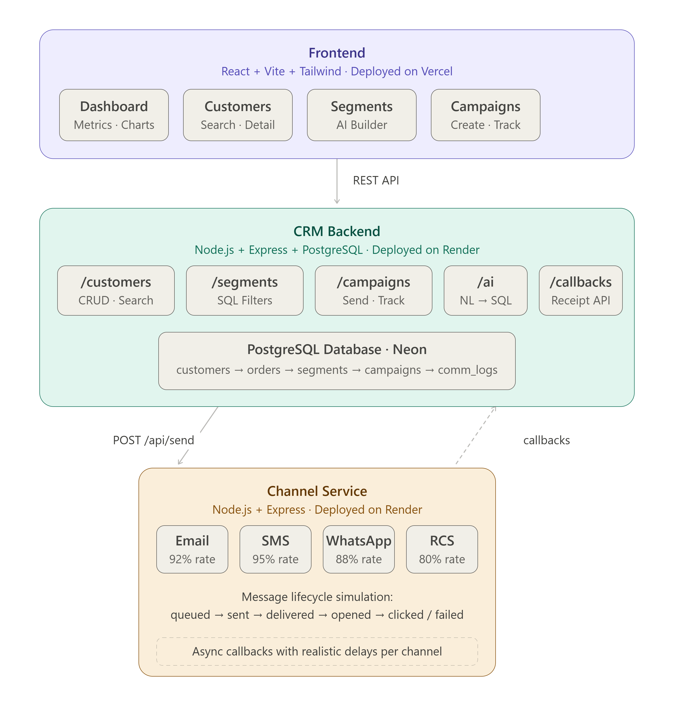

# ReachAI — Backend

> CRM API backend for ReachAI — built with Node.js, Express, and PostgreSQL.

**Frontend Repo:** [reachai-frontend](https://github.com/NIKHIL-14238/reachai-frontend) · **Channel Service Repo:** [reachai-channel-service](https://github.com/NIKHIL-14238/reachai-channel-service)

---

## What This Is

ReachAI is a Mini CRM that helps consumer brands intelligently reach their shoppers. This repo contains the backend — a Node.js REST API that powers all CRM operations including AI-native segmentation, campaign management, and real-time delivery tracking.

Built as part of the **Xeno Engineering Internship Assignment 2026**.

---

## System Architecture



### Campaign Delivery Loop

```
POST /api/campaigns/:id/send
        │
        ▼
Fetch all customers in segment
        │
        ▼
Create communication_log per customer (status: queued)
        │
        ▼
Fire POST to Channel Service (async, non-blocking)
        │
        ▼
Channel Service simulates delivery with delays
        │
        ├── POST /api/callbacks/status {delivered}
        ├── POST /api/callbacks/status {opened}
        ├── POST /api/callbacks/status {clicked}
        └── POST /api/callbacks/status {failed}
                │
                ▼
        Update comm_log + increment campaign counters
```

### AI Segmentation Flow

```
POST /api/ai/segment { query: "Women from Mumbai under 30" }
        │
        ▼
Query DB for real cities + data ranges
        │
        ▼
Build prompt with schema + context + examples
        │
        ▼
Call AI model → returns SQL WHERE clause
        │
        ▼
Validate with SELECT COUNT(*) WHERE {filter}
        │
        ▼
Return { filter_query, customer_count, suggested_name }
```

---

## API Routes

| Route | Method | Description |
|-------|--------|-------------|
| `/api/customers` | GET | List customers with search + pagination |
| `/api/customers/:id` | GET | Customer detail with orders + comm history |
| `/api/customers/bulk` | POST | Bulk import customers |
| `/api/orders` | GET, POST | Order management |
| `/api/orders/bulk` | POST | Bulk import orders |
| `/api/segments` | GET, POST | List and create segments |
| `/api/segments/preview` | POST | Preview segment without saving |
| `/api/segments/:id` | GET, DELETE | Segment detail and delete |
| `/api/campaigns` | GET, POST | List and create campaigns |
| `/api/campaigns/:id/send` | POST | Send campaign to segment |
| `/api/campaigns/:id/logs` | GET | Individual delivery logs |
| `/api/analytics/overview` | GET | Dashboard metrics |
| `/api/analytics/campaigns` | GET | Campaign performance |
| `/api/analytics/channels` | GET | Channel breakdown |
| `/api/ai/segment` | POST | Natural language → SQL filter |
| `/api/ai/message` | POST | AI message drafting |
| `/api/ai/suggest` | POST | AI campaign suggestions |
| `/api/callbacks/status` | POST | Receive delivery status from channel service |
| `/api/callbacks/batch` | POST | Batch status updates |
| `/health` | GET | Health check |

---

## Database Schema

```
customers
  id, name, email, phone, city, age, gender,
  total_spent, order_count, last_order_date, created_at

orders
  id, customer_id, order_number, amount,
  items (JSONB), status, channel, created_at

segments
  id, name, description, filter_query,
  natural_language_query, customer_count, created_at

segment_members
  segment_id, customer_id

campaigns
  id, name, segment_id, channel, subject,
  message_template, status,
  total_sent, total_delivered, total_failed,
  total_opened, total_clicked,
  scheduled_at, sent_at, created_at

communication_logs
  id, campaign_id, customer_id, channel,
  recipient, message, status, external_id,
  sent_at, delivered_at, opened_at,
  clicked_at, failed_at, failure_reason, created_at
```

---

## Tech Stack

| Tool | Purpose |
|------|---------|
| Node.js + Express | REST API server |
| PostgreSQL | Primary database |
| Neon | Managed PostgreSQL hosting |
| node-fetch | HTTP calls to channel service and AI |
| uuid | Unique IDs for message tracking |
| OpenRouter API | AI model for segmentation and message drafting |

---

## Local Development

```bash
git clone https://github.com/NIKHIL-14238/reachai-backend.git
cd reachai-backend
npm install
cp .env.example .env
# Fill in your values
npm run seed    # Load 200 demo customers + 500 orders
npm run dev     # Start with nodemon
```

### Environment Variables

| Variable | Description |
|----------|-------------|
| `DATABASE_URL` | PostgreSQL connection string (Neon) |
| `OPENROUTER_API_KEY` | OpenRouter API key for AI features |
| `CHANNEL_SERVICE_URL` | Channel service URL |
| `CRM_CALLBACK_URL` | This backend's public URL (for callbacks) |
| `NODE_ENV` | `production` or `development` |
| `PORT` | Server port (default 3000) |

---

## Project Structure

```
backend/
├── server.js              # Entry point, DB init, middleware, routes
├── routes/
│   ├── customers.js       # Customer CRUD + search + bulk import
│   ├── orders.js          # Order management + aggregate updates
│   ├── segments.js        # Audience segmentation with SQL filters
│   ├── campaigns.js       # Campaign lifecycle — create, send, track
│   ├── analytics.js       # Dashboard metrics and charts
│   ├── ai.js              # AI endpoints — NL→SQL, message drafting
│   └── callbacks.js       # Receipt API for channel service callbacks
└── seeds/
    └── seed.js            # Demo data — 200 Indian customers, 500+ orders
```

---

## Deployment (Render)

1. Push to GitHub
2. Go to [render.com](https://render.com) → New → Web Service
3. Connect repo, set:
   - **Build Command:** `npm install`
   - **Start Command:** `npm start`
4. Add all environment variables
5. Deploy
6. Run seed: go to Render Shell → `npm run seed`

---

## Key Design Decisions

| Decision | Choice | Reason |
|----------|--------|--------|
| Database | PostgreSQL | Relational — customer → order relationships fit SQL naturally |
| Computed aggregates | `total_spent`, `order_count` on customer | Avoids expensive JOINs on every dashboard query |
| Async campaign sending | Fire-and-forget to channel service | Frontend gets immediate response — delivery happens in background |
| Callback pattern | Channel service calls back into `/api/callbacks` | Mirrors how real providers (Twilio, Gupshup) work in production |
| AI provider | OpenRouter (free tier) | Free, flexible, supports multiple model backends |
| SQL validation | Run COUNT before saving segment | Prevents invalid filters from being saved |

---

## Scale Tradeoffs

- **Current scope:** handles ~1000 customers, campaigns of ~500 messages
- **At scale I'd add:** message queue (RabbitMQ/SQS) instead of direct HTTP to channel service, Redis caching for analytics, PgBouncer for connection pooling, idempotency keys on callbacks
- **Deliberately excluded:** Authentication, rate limiting, real-time WebSockets — not core to the brief scope

---

## Author

**Nikhil** — Xeno SDE Internship Assignment 2026
